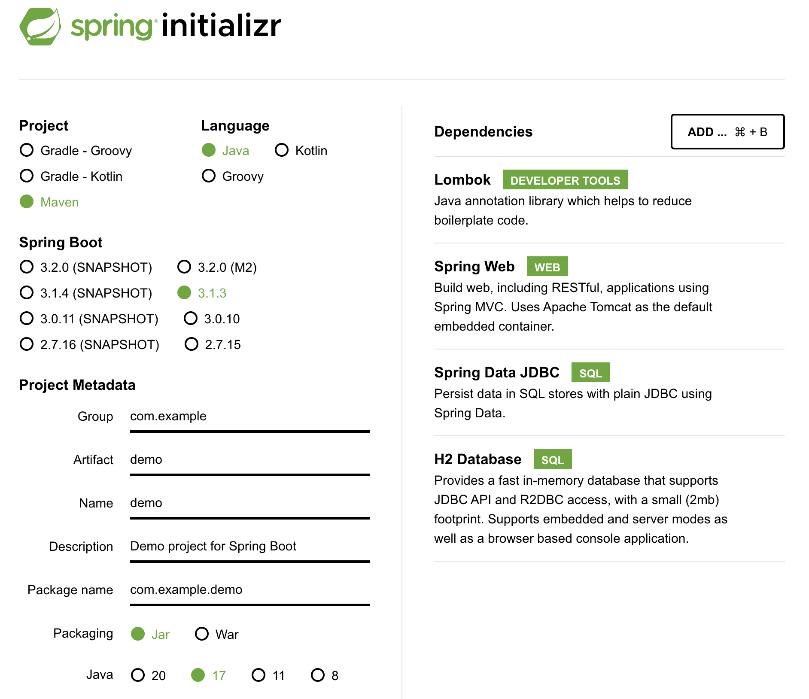

# Saskatchewan Polytechnic demo

We are going to create a Spring Boot REST CRUD application in 15 minutes or less... hopefully.

## Technologies we are using
* Spring - Java framework that provides comprehensive infrastructure support for developing Java applications
* Spring Boot - Makes it easy to create stand-alone, production-grade Spring based applications that you can "just run"
* Lombok - A java library that plugs into your editor and build tools, removing a ton of boilerplate.
* JDBC - The standard Java API that manages connecting to a database, issuing queries, and handling result sets.
* Spring data - Provides a familiar and consistent, Spring-based programming model for data access while still retaining the special traits of the underlying data store.
* H2 - An in-memory database
* Maven - Dependency management and build tool

## How to generate your own spring boot project
This project was generated using https://start.spring.io with the following options:

